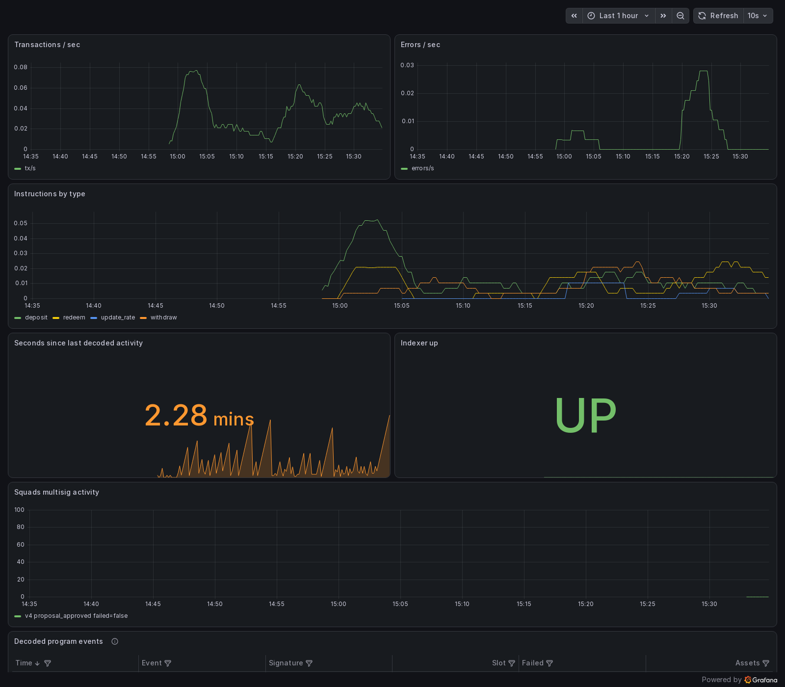
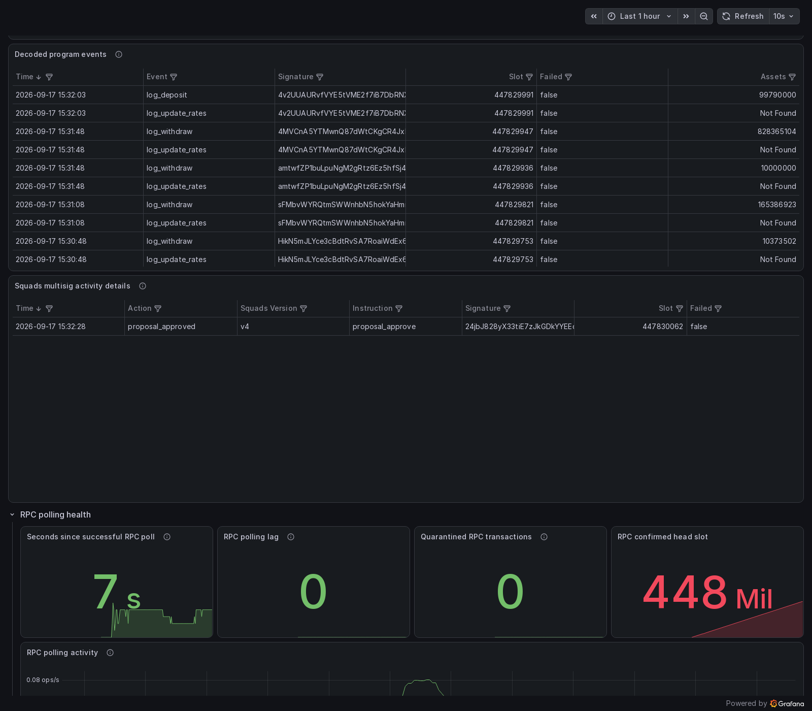

# Walkthrough: monitoring Jupiter Lend

> **This is a teaching example, not a service.** Jupiter Lend was chosen
> because it is a real protocol whose IDL is published, whose volume fits a
> laptop, and whose upgrade authority is a Squads multisig. Solana Foundation
> does not operate this deployment, does not monitor Jupiter Lend on anyone's
> behalf, and is not affiliated with or endorsed by Jupiter. Nothing here is a
> security assessment of Jupiter Lend, and none of it is financial advice. The
> program IDs, multisig addresses, and IDL in this example were verified
> against mainnet on 2026-09-17; a protocol can upgrade its programs or move
> its governance at any time, so confirm them yourself before relying on this
> config.

This walkthrough runs the full Microscope stack against a live mainnet DeFi
protocol, [Jupiter Lend](https://jup.ag/lend), plus the Squads multisig that
holds its upgrade authority. It needs Docker, a public Solana RPC endpoint, and
about ten minutes. Nothing here is specific to Jupiter: swap three values at the
end and the same walkthrough monitors your own program.

## What you end up with

- Decoded `deposit`, `withdraw`, `redeem`, and `rebalance` instructions, with
  their `log_deposit` / `log_withdraw` / `log_update_rates` events and the
  amounts inside them
- Critical alerts on `update_authority` and `update_auths`, the instructions
  that change who controls the lending program
- A warning whenever the Squads multisig that can upgrade the program creates a
  proposal
- A Grafana dashboard over all of it

## Why this program

Jupiter Lend is a good example for three reasons that are worth checking for
whatever program you monitor next:

1. **Its IDL is available.** The Anchor IDL is published at
   [`jup-ag/jupiter-lend`](https://github.com/jup-ag/jupiter-lend) under
   `target/idl/`. Microscope decodes from an IDL; without one there is nothing
   to decode. `examples/jupiter-lend/lending.json` is a copy of
   `target/idl/lending.json` at version `0.1.4`.
2. **Its volume fits a laptop.** The lending program sees under one transaction
   per second, so a polled public RPC endpoint keeps up and the local Loki
   volume stays small. A high-volume AMM at 200+ transactions per second needs a
   Yellowstone gRPC subscription and real disk.
3. **It is governed by a Squads multisig.** Its upgrade authority,
   `4MsgBB5VPoTrUSp5XnfbViV386C1UnsTdifLBw33ZMSJ`, is a Squads v4 vault, so one
   deployment covers both the protocol and the governance that can change it.

Jupiter Lend is made of three programs that share that one multisig. This
walkthrough monitors `lending`, the Earn side. Swapping to another one is three
lines, covered at the end.

## 1. Clone and select the example config

```sh
git clone https://github.com/solana-foundation/solana-microscope.git
cd solana-microscope
cp examples/jupiter-lend/microscope.toml microscope.toml
```

`microscope.toml` at the repository root is the deployment config, and it is
gitignored. The copy under `examples/` is the source you started from.

## 2. Point it at an RPC endpoint

Create a `.env` file:

```dotenv
RPC_URL=https://api.mainnet-beta.solana.com
GRAFANA_ADMIN_PASSWORD=replace-with-a-strong-password
```

The example config sets `datasource.mode = "rpc"`, so no Yellowstone endpoint is
needed. A public endpoint is enough at this program's volume; a dedicated
endpoint is steadier if you leave the stack running for days.

## 3. Start the stack

```sh
just up
docker compose logs --follow indexer
```

The first run generates the decoder crates from the IDL, which takes a few
minutes. On startup the indexer confirms the multisig addresses against the
chain:

```text
microscope-indexer starting: program_id=jup3YeL8QhtSx1e253b2FDvsMNC87fDrgQZivbrndc9 datasource=rpc alert_rules=5
verified configured Squads v4 vault 4MsgBB5VPoTrUSp5XnfbViV386C1UnsTdifLBw33ZMSJ and state account J3mJ3wz6xkVUk3T8qHnuAYNxsRH3ixHsryYNZAU2vG8P
RPC polling for jup3YeL8QhtSx1e253b2FDvsMNC87fDrgQZivbrndc9 starts at slot 447813741, replaying up to confirmed slot 447814041
```

Within a minute or two, decoded records start appearing. A deposit looks like
this, trimmed to the interesting fields:

```json
{
  "kind": "program_instruction",
  "name": "deposit",
  "data": { "data": { "assets": 420000000 } },
  "instruction_path": "2.0",
  "signature": "46fX6TToBvj6GMZnpnhbcry9VF26a8d7hinY9g5GJWXn2dasDXkuLRimVLfMHDMjrawPzbkn9rfeHQBQzdGyWhGX",
  "slot": 447813527,
  "failed": false
}
{
  "kind": "program_event",
  "name": "log_deposit",
  "instruction": "deposit",
  "data": {
    "assets": 420000000,
    "shares_minted": 399977926,
    "sender": "Ev4gtghXTSAgzcxPzY84VKvLuWfjYYsXaDDkuPm4rbx5",
    "receiver": "Ev4gtghXTSAgzcxPzY84VKvLuWfjYYsXaDDkuPm4rbx5"
  },
  "signature": "46fX6TToBvj6GMZnpnhbcry9VF26a8d7hinY9g5GJWXn2dasDXkuLRimVLfMHDMjrawPzbkn9rfeHQBQzdGyWhGX",
  "slot": 447813527
}
```

The `instruction_path` of `2.0` means this deposit was a nested instruction:
most Jupiter Lend traffic reaches the lending program through a CPI rather than
as a top-level instruction, and Microscope decodes it either way.

## 4. Look at it in Grafana

Open <http://localhost:3000> and sign in as `admin` with the password from
`.env`. The generated overview dashboard shows instruction and event rates,
recent records, and multisig activity.



`Errors / sec` counts decoded instructions that failed on chain, which is
ordinary for a lending program: a withdraw can revert. It does not mean the
indexer is unhealthy. The `Squads multisig activity` series appears only once
the multisig does something; in the capture above it is a `proposal_approved`
that landed during the run.

Further down are the record tables. The event table's columns come from
`dashboard.event_fields` in the config, which is why `Assets` is its own column
with the decoded `data.assets` value in it. `Not Found` means that event has no
such field, `log_update_rates` carries exchange prices rather than an amount.



Indexer metrics are at <http://localhost:9090/metrics>, and health probes at
<http://localhost:9091/healthz> and <http://localhost:9091/readyz>.

## 5. Look at the alerts

Grafana's Alerting page lists the five deployment rules from the config
alongside the built-in health rules. `event log_deposit` fires on ordinary
traffic within a minute or two, which is the quickest way to confirm the
pipeline end to end.

The other four are the ones that matter in practice. They are deliberately
quiet: `update_authority`, `update_auths`, and `set_rewards_rate_model` are
privileged instructions, and `proposal_created` fires when the multisig that
can upgrade the program proposes anything. A month of silence followed by one
notification is the intended behavior.

Every alert in the example leaves `channels = []`, so the rules evaluate without
notification credentials. To get notified, set the channel's values in `.env`
and add the channel to the alert:

```toml
[[alerts]]
kind = "instruction"
name = "update_authority"
severity = "critical"
channels = ["slack"]
```

Then rerun `just up`. Grafana reads alert provisioning only at startup, so
restarting Grafana alone leaves the previous rules in place.

## Monitoring a different program

Three values change. For the Jupiter Lend Borrow side:

```toml
program_id = "jupr81YtYssSyPt8jbnGuiWon5f6x9TcDEFxYe3Bdzi"
idl_path = "examples/jupiter-lend/vaults.json"
```

Download the matching IDL first:

```sh
curl -o examples/jupiter-lend/vaults.json \
  https://raw.githubusercontent.com/jup-ag/jupiter-lend/main/target/idl/vaults.json
```

The alert names have to change too, because they are validated against the IDL.
The vaults program's risk parameters are the interesting ones:
`update_collateral_factor`, `update_liquidation_threshold`,
`update_liquidation_penalty`, and `update_borrow_fee`. The multisig section
stays as it is: all three Jupiter Lend programs share that multisig.

For your own program, replace `program_id`, `idl_path`, and the `[multisig]`
section, then rewrite the alerts against your IDL's instruction and event names.
The [`setup-deployment`](../../.claude/skills/setup-deployment/SKILL.md) Claude
Code skill does this interviewing and derives the alert rules for you.

## Two things that trip people up

**Event and instruction names are snake_case.** Alert names are matched against
the generated decoder, not the raw IDL, so the IDL's `LogDeposit` event is
`log_deposit` in the config. A mismatch fails at startup with the valid list:

```text
alerts entry at index 3 names an unknown event signal "LogDeposit"; this
deployment emits log_deposit, log_rebalance, log_update_authority, ...
```

**Regenerate after changing the IDL or the program.** Every Justfile target that
compiles runs `just generate` first, so `just up` handles it. A bare
`cargo build` on a fresh clone does not.

## Cleaning up

```sh
docker compose down --volumes
```

Without `--volumes`, the Prometheus, Loki, and Grafana data stays on disk for
the next run.
